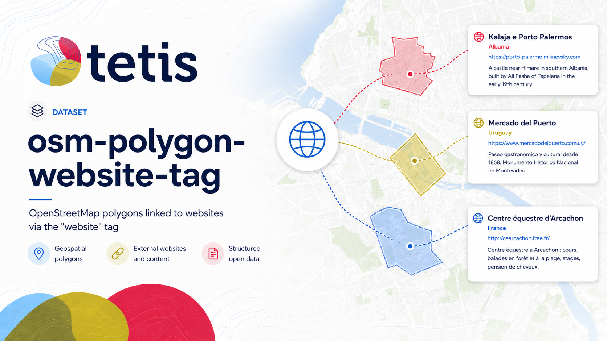

# osm-polygon-website-tag



A repository for analysing OpenStreetMap (OSM) polygons that carry a
`website` or `contact:website` tag.

Read the [project documentation](https://noeflandre.github.io/osm-polygon-website-tag/)
for setup, architecture, and data-publication guidance.

The project streams polygons (closed ways and assembled multipolygon
relations) from local PBF files, classifies their `website` and
`wikidata` tags, extracts full main text independently from both
`website` and `contact:website` with Trafilatura, and publishes a
deterministic public polygon dataset
under the [Open Database License (ODbL) 1.0] to
[Hugging Face](https://huggingface.co/datasets/NoeFlandre/osm-polygon-website-tag).

> **Status:** deterministic polygon-extraction pipeline implemented and
> locally verified on synthetic fixtures. The production run over the
> Seagate PBF collection has not been executed (this commit is a
> readiness review only).

## Dataset at a glance

The public dataset contains one Parquet shard per source PBF, in a
run-owned directory. Each row corresponds to one OSM object whose
`website` or `contact:website` tag is non-empty and whose geometry was successfully
assembled by libosmium (closed way or multipolygon/boundary relation).
The schema is versioned (`v1.3`) and documented column-by-column in
`osm_polygon_website_tag.polygon_schema`. The full text of the dataset
card is regenerated from the shards by `osm-polygon-website-tag
build-card`.

## Quick start

```bash
# 1. Install uv (once, if missing)
brew install uv

# 2. Sync dependencies into an isolated .venv
uv sync --group dev

# 3. Install Just once, then synchronize and install Git hooks
brew install just
just sync
just install-hooks

# 4. Run the complete local/CI quality suite
just check
```

Just is only a command runner: Python and every Python tool still execute
inside the uv-locked project `.venv`. The equivalent individual commands are
documented in [`docs/setup.md`](docs/setup.md).

## CLI

The CLI is phase-oriented. Only `extract` opens a PBF, and every source
must first be recorded in the immutable expected-source inventory.
Publication is opt-in and dry-runs by default.

For the reviewed production workflow, one command discovers every PBF and
records the exact inventory. It then extracts, enriches, recomputes the card,
uploads, and checkpoints one PBF before moving to the next. After the inventory
finishes, it builds and publishes the receipt-bound analysis and final card:

```bash
uv run osm-polygon-website-tag run-all \
  --source-root '/Volumes/Seagate M3/projects/osm-polygon-wikidata-only/raw' \
  --output-root '/Volumes/Seagate M3/projects/osm-polygon-website-tag-data/runs' \
  --run-id 'geofabrik-website-v1' \
  --repo-id 'NoeFlandre/osm-polygon-website-tag' \
  --ensure-repo \
  --apply
```

Press `Ctrl-C` to stop. Run the exact same command to resume. Successfully
promoted local shards, successful URL extractions, and acknowledged per-PBF
uploads are checkpointed. Existing v1.1 shards are enriched without rereading
their PBF; only failed URLs retry on a later invocation. During a shard
enrichment, cache commits and completed Parquet batches are durable, so Ctrl-C
preserves the completed prefix and resumes from the first unfinished batch.
Source inventory drift or local shard mutation fails closed.

After each PBF is enriched, its Parquet plus a freshly artifact-derived
`README.md`, `dataset.yaml`, and logarithmic H3 resolution-3 density map are
uploaded together before the next PBF is opened. Old runs that already extracted several PBFs reuse every verified local
bundle and begin with enrichment/upload; they do not reread those PBFs. The card
reports exact word totals for both website tags. Full extracted text is never
truncated.

The default `run-all` settings use four bounded geometry workers, at most 32
in-flight area payloads, and eight bounded URL workers. They can be tuned for a
machine with `--area-workers`, `--max-in-flight-areas`, and `--fetch-workers`
(safe caps are enforced); PBF processing remains sequential and output order is
unchanged.

The generated Hugging Face card is intentionally concise: it presents current
progress, polygon and text-extraction totals, combined word count, top
hostnames, public schema, methodology, and attribution. Detailed overlap and
per-source results remain in `analysis/*.parquet`. The optional
`task_categories` metadata is omitted because this geographic source dataset
does not map to an official Hugging Face machine-learning task.

The card map is stored locally at
`assets/geographic_polygon_density.png` and counts public polygon centroids
once per H3 cell. It is rendered headlessly and atomically with the bundled
Natural Earth 1:110m land backdrop, without network access. A completed run created before this map contract is upgraded
on resume without reopening PBFs; the same local-only migration is available as:

```bash
uv run osm-polygon-website-tag refresh-card \
  --run-dir '/Volumes/Seagate M3/projects/osm-polygon-website-tag-data/runs/<run_id>'
```

Schema v1.3 removes the redundant public columns `preferred_website`,
`preferred_website_source`, `wikidata`, `wikidata_qid`, `wikidata_class`, and
`area_km2`. Wikidata comparison fields remain in the analysis observations, and
all original OSM tags remain available in `tags`. Existing v1.2 shards are
projected atomically and reuploaded by content hash without reopening PBFs or
refetching website text.

The low-level phase commands are intended for development and recovery. Website
enrichment is deliberately orchestrated by `run-all`, which owns its persistent
URL cache, retry invocation, state transitions, and per-source upload checkpoint.
The checkpoint is operational state and is excluded from the final receipt;
the receipt binds the map, card, analysis, manifests, and Parquet artifacts only
after final verification.
After a run completes, it can be verified again or its publication plan inspected:

```bash
uv run osm-polygon-website-tag verify-results \
  --run-dir '/Volumes/Seagate M3/projects/osm-polygon-website-tag-data/runs/<run_id>'
uv run osm-polygon-website-tag publish \
  --run-dir '/Volumes/Seagate M3/projects/osm-polygon-website-tag-data/runs/<run_id>'

# 7. Real publication (requires a separately reviewed approval)
hf auth login
uv run osm-polygon-website-tag publish \
  --run-dir '/Volumes/Seagate M3/projects/osm-polygon-website-tag-data/runs/<run_id>' \
  --apply
```

The CLI never accepts an HF token as a flag; tokens are read from
`HF_TOKEN`, `HUGGING_FACE_HUB_TOKEN`, or the local Hugging Face
credential store via `hf auth login`.

The installed CLI is built with Typer. Rich provides terminal-aware
human-facing output, while JSON on stdout remains plain and scriptable.
Interactive `run-all` progress uses tqdm; redirected stderr retains stable
line-oriented progress logs.

## Project layout

```
.
├── pyproject.toml          # Project metadata + tooling config
├── uv.lock                 # Locked dependency versions
├── README.md               # You are here
├── AGENTS.md               # Conventions for AI coding agents
├── docs/                   # Long-form documentation
│   ├── setup.md            # Detailed environment setup
│   ├── architecture.md     # How the modules fit together
│   └── data-and-remotes.md # Where data lives and how it gets to HF
├── scripts/                # Operational scripts (HF upload, data prep)
├── src/osm_polygon_website_tag/
│   ├── contracts/          # Exact Arrow and text contracts
│   ├── domain/             # OSM classification and geometry rules
│   ├── storage/            # Bounded and transactional local I/O
│   ├── web/                # Safe fetch, Trafilatura, and URL cache
│   ├── runtime/            # Configuration, paths, safety, run lifecycle
│   ├── pipeline/           # Extraction, enrichment, and analysis stages
│   ├── reporting/          # Cards, verification, and finalization
│   ├── publishing/         # Hugging Face credentials and upload
│   ├── application/        # Workflow composition and CLI
│   └── py.typed            # PEP 561 type-distribution marker
└── tests/                  # Mirrored hermetic pytest suite + architecture checks
```

## Where data lives

| Concern                   | Location                                                       |
| ------------------------- | -------------------------------------------------------------- |
| Code                      | This repository (local, git)                                   |
| Source PBFs (read-only)   | `/Volumes/Seagate M3/projects/osm-polygon-wikidata-only/raw`   |
| Local data root           | Configurable via `OSM_POLY_DATA_DIR` (see `paths.py`)          |
| Analysis output           | Configurable `--output-root`; one run-owned directory per run |
| Published dataset         | https://huggingface.co/datasets/NoeFlandre/osm-polygon-website-tag |

## License

* **Source code**: Apache-2.0. See [LICENSE](LICENSE).
* **Published dataset**: [ODbL 1.0]. The dataset carries the ODbL
  notice, the OpenStreetMap contributor attribution, and the Geofabrik
  extract-provider attribution rendered in `README.md` and
  `dataset.yaml`.

[ODbL 1.0]: https://opendatacommons.org/licenses/odbl/1-0/

## Citation

If you use this software or the accompanying dataset, please cite this
project. The complete machine-readable citation is available in
[`CITATION.cff`](CITATION.cff), and GitHub exposes it through the repository's
**Cite this repository** action.

> Flandre, Noé. *OSM Polygon Website Tag*. Version 0.1.0.
> [https://github.com/NoeFlandre/osm-polygon-website-tag](https://github.com/NoeFlandre/osm-polygon-website-tag)
