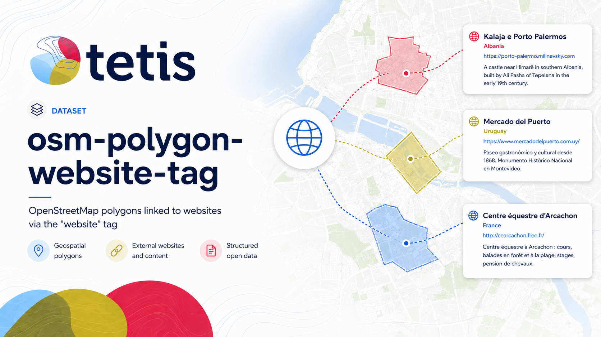

# OSM Polygon Website Tag



A reproducible pipeline and public dataset for OpenStreetMap (OSM) polygons
with a non-empty `website` or `contact:website` tag. The current snapshot is
complete and published; the dataset card is the source of truth for its totals.

[Hugging Face dataset card](https://huggingface.co/datasets/NoeFlandre/osm-polygon-website-tag) ·
[Trackio metrics](https://huggingface.co/spaces/NoeFlandre/osm-polygon-website-tag-metrics) ·
[Documentation](https://noeflandre.github.io/osm-polygon-website-tag/) ·
[Latest release: v0.1.0](https://github.com/NoeFlandre/osm-polygon-website-tag/releases/tag/v0.1.0) ·
[Citation](CITATION.cff)

## What this project produces

The pipeline reads immutable OSM PBF extracts and selects polygon geometries
from closed ways and supported polygon relations. It then:

- preserves the original OSM tags and provenance;
- stores one versioned Parquet shard per source PBF;
- extracts the main text independently from `website` and `contact:website`
  with [Trafilatura](https://trafilatura.readthedocs.io/);
- records text status, word counts, geometry, and source metadata;
- generates an artifact-derived dataset card and a text-only H3 geographic map;
  and
- reports deterministic polygon geometry statistics (surface, shape, extent)
  for every published row in `stats.json` and in a dataset-card block.

The default public polygon schema is versioned (`v1.3`) and documented in
[`contracts/polygon_schema.py`](src/osm_polygon_website_tag/contracts/polygon_schema.py).
The opt-in `--detect-languages` stage adds GlotLID top-1 labels and
probabilities as schema `v1.4`, and the opt-in sentence stage adds SaT
sentences, their counts, and a per-field segmentation status as schema `v1.5`
(see [Outputs](#outputs)). Both keep their model caches under the data root
(see [Configuration](#configuration)). Full extracted text is retained without truncation.
Current row, text, and word
totals are maintained in the [dataset card](https://huggingface.co/datasets/NoeFlandre/osm-polygon-website-tag),
not duplicated here.

Website content remains third-party material: the pipeline applies URL safety
checks before fetching it, and the dataset does not grant additional rights to
that content.

## Install

The project uses Python 3.12, [`uv`](https://docs.astral.sh/uv/getting-started/installation/)
and [`just`](https://just.systems/man/en/packages.html); both links cover Linux,
macOS and Windows (on macOS: `brew install uv just`). From a fresh clone:

```bash
git clone https://github.com/NoeFlandre/osm-polygon-website-tag
cd osm-polygon-website-tag
just sync
just check
```

## Usage

Run the pipeline with an immutable, read-only PBF directory and a separate
writable output directory:

```bash
uv run --locked osm-polygon-website-tag run-all \
  --source-root /path/to/read-only/pbf-root \
  --output-root /path/to/writable/runs \
  --run-id website-v1
```

`Ctrl-C` is safe. Repeat the same command to resume verified shards, URL-cache
results, completed enrichment batches, and acknowledged uploads. PBF inputs are
never modified; PBF processing stays sequential while extraction and fetching
use bounded workers. See [Operations and resume](docs/operations.md) for the
checkpoint and freeze rules.

Language detection is opt-in and can be included in the same resumable run:

```bash
uv run --locked osm-polygon-website-tag run-all \
  --source-root /path/to/read-only/pbf-root \
  --output-root "$OSM_POLY_DATA_DIR/runs" \
  --run-id website-v1 \
  --detect-languages
```

For an already enriched run, use the standalone stage instead:

```bash
uv run --locked osm-polygon-website-tag detect-languages \
  --run-dir "$OSM_POLY_DATA_DIR/runs/website-v1"
```

The pinned [GlotLID model](https://huggingface.co/cis-lmu/glotlid) is downloaded
under `$OSM_POLY_DATA_DIR/models/glotlid/`. Language runs must live under the
data root.
The default `run-all` path does not load or download it.

Language detection can also run in short, offline Grid'5000 jobs through the
wrappers in `scripts/grid5000/`; see
[Operations and resume](docs/operations.md#run-language-detection-on-grid5000).

Sentence segmentation runs the same way, one bundle of several shards per job,
on a reserved GPU: see
[Segment sentences on Grid'5000](docs/operations.md#segment-sentences-on-grid5000).
The published snapshot was segmented entirely on reserved Grid'5000 nodes.

For a reproducible container workflow, see [Getting started](docs/setup.md#docker-workflow).

## Configuration

Settings are read from the environment or a `.env` file (see
[`.env.example`](.env.example)):

| Variable | Meaning | Default |
| --- | --- | --- |
| `OSM_POLY_DATA_DIR` | Data root for runs, model caches and Grid'5000 bundles | `./data` |
| `HF_DATASET_REPO` | Hugging Face dataset that receives published artifacts | `NoeFlandre/osm-polygon-website-tag` |
| `HF_TOKEN` | Hugging Face token for publishing (or use `hf auth login`) | none |

## Outputs

Each run owns `<output-root>/<run-id>/`:

```text
polygons/<source-stem>.parquet     one polygon shard per source PBF
rejections/, analysis/             rejected rows and analysis tables
manifests/                         run state, uploads and completion receipt
README.md, dataset.yaml, stats.json   dataset card, config and statistics
assets/                            the geographic density map
```

The polygon schema grows with each opt-in stage:

| Schema | Stage | Adds |
| --- | --- | --- |
| `v1.3` | `run-all` (default) | tags, geometry, provenance, extracted text, text status, word counts |
| `v1.4` | `--detect-languages` / `detect-languages` | `website_language`, `contact_website_language` and their probabilities |
| `v1.5` | sentence segmentation | `*_sentences`, `*_sentence_count`, `*_sentence_status` per field |

See [Data and remotes](docs/data-and-remotes.md) for the full layout and the
publication contract.

## Load the dataset

```python
from datasets import load_dataset

dataset = load_dataset("NoeFlandre/osm-polygon-website-tag")
```

## Publish deliberately

Local runs do not become public automatically. Inspect a complete run first:

```bash
uv run --locked osm-polygon-website-tag verify-results \
  --run-dir /path/to/writable/runs/website-v1
uv run --locked osm-polygon-website-tag publish-plan \
  --run-dir /path/to/writable/runs/website-v1 \
  --repo-id NoeFlandre/osm-polygon-website-tag
```

After separate approval, authenticate with `hf auth login` and add `--apply` to
`publish`. The CLI reads credentials from the environment or the local
Hugging Face credential store; it never accepts a token as a command-line
argument. See [Data and remotes](docs/data-and-remotes.md) for the publication
contract.

The optional [Trackio Space](https://huggingface.co/spaces/NoeFlandre/osm-polygon-website-tag-metrics)
shows a small set of aggregate snapshot metrics. It is updated explicitly from
a verified snapshot and receives no website text or credentials.

## Development

The repository is organized as a `src/` package with mirrored hermetic tests:

```text
src/osm_polygon_website_tag/   pipeline, contracts, storage, web, reporting
tests/                          unit, integration, and architecture checks
docs/                           MkDocs Material documentation
```

Useful commands:

| Task | Command |
| --- | --- |
| Full quality suite (fast) | `just check` |
| Completion QA gauntlet | `just qa-gauntlet` |
| Tests | `just test` |
| Unit tests | `just unit` |
| Acceptance tests | `just acceptance` |
| Architecture checks | `just architecture` |
| Lint and format | `just lint` / `just format-check` |
| Type checking | `just typecheck` |
| Hooks | `just pre-commit` / `just pre-push` |
| Documentation | `uv run --locked mkdocs build --strict` |
| Container smoke test | `just docker-smoke` |

Ruff, `ty`, pytest, pre-commit, Just, Docker, and GitHub Actions keep the
workflow reproducible and reviewable. The detailed [CLI reference](docs/cli.md)
and [architecture guide](docs/architecture.md) explain the implementation
boundaries.

## License and data boundaries

- **Source code:** [Apache-2.0](LICENSE).
- **OSM-derived dataset:** [ODbL 1.0](https://opendatacommons.org/licenses/odbl/1-0/),
  with OpenStreetMap and Geofabrik attribution in the dataset card.
- **Website text:** fetched third-party content under the terms of its
  respective publishers; no additional reuse rights are granted here.
- **Language model:** the GlotLID binary is local operational state under the
  data root; it is not committed to Git or included in the dataset.
- **Source PBFs:** read-only inputs supplied explicitly by the operator; run
  artifacts are written to a separate output root and are not committed to Git.

## Citation

Please cite the project using [`CITATION.cff`](CITATION.cff). GitHub's
**Cite this repository** action and the Hugging Face dataset card both expose
the machine-readable citation. In BibTeX:

```bibtex
@software{flandre_osm_polygon_website_tag,
  author  = {Flandre, Noé},
  title   = {{OSM Polygon Website Tag}},
  version = {0.1.0},
  license = {Apache-2.0},
  url     = {https://github.com/NoeFlandre/osm-polygon-website-tag}
}
```
